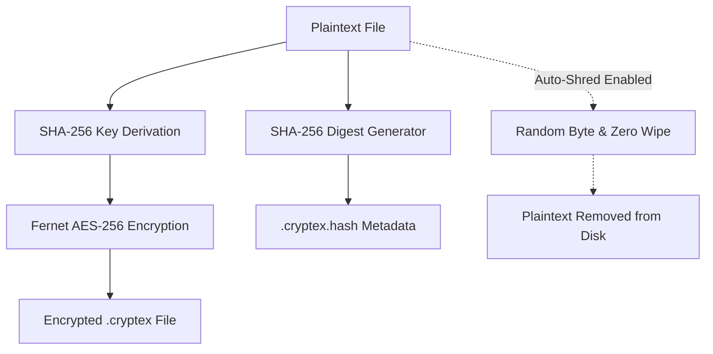

<div align="center">

# ⚡ Cryptex — Secure File Encryption
### *High-Performance Cryptographic Security Suite & Encrypted Password Vault*

[](https://github.com/OjasPurohit)
[](https://github.com/OjasPurohit/Cryptex)
[](https://www.python.org/)
[](https://cryptography.io/)
[](https://github.com/TomSchimansky/CustomTkinter)
[](https://microsoft.com/windows)
[](LICENSE)

<br />

**Cryptex** is an ultra-sleek, native desktop cryptographic workstation built for secure file encryption, integrity verification, entropy analysis, password generation, and encrypted credential vault storage.

</div>

---

## 🌟 Key Features

### 🔒 1. Military-Grade File Encryption & Decryption
- **Authenticated AES-256**: Uses Fernet (AES-128/256-CBC with HMAC-SHA256) for authenticated, tamper-proof file encryption.
- **Universal Format Support**: Encrypts any binary or text format (`.pdf`, `.docx`, `.zip`, `.mp4`, `.png`, `.iso`, `.exe`, etc.).
- **Automatic Integrity Hash**: Generates a paired SHA-256 cryptographic digest alongside every encrypted archive (`.cryptex.hash`) to verify file authenticity prior to restoration.

### 🧹 2. Anti-Forensic Auto-Shredding
- **Secure File Destruction**: Optional active toggle to securely shred original plaintext files immediately after successful encryption.
- **Multi-Pass Sanitization**: Overwrites file blocks with cryptographic random noise from OS CSPRNG (`secrets.token_bytes`) followed by zero-fill sanitization before unlinking from the filesystem.

### ☠️ 3. Anti-Tamper Self-Destruct Protection
- **Brute-Force Defense**: Built-in counter tracks failed decryption attempts.
- **Permanent Wipe**: After 3 consecutive incorrect passphrase attempts, the encrypted payload is permanently sanitized and shredded from the storage directory.

### 🔐 4. Zero-Knowledge Encrypted Password Vault
- **PBKDF2 Key Derivation**: Master keys are derived with PBKDF2-HMAC-SHA256 and cryptographic salts.
- **Dynamic Vault State Management**:
  - *Uninitialized*: Guided initial setup for master password creation.
  - *Locked*: Secure credential lockdown with reset/purge capabilities.
  - *Unlocked*: Real-time category filtering, clipboard instant-copy, and master key rotation with entry re-encryption.

### 🔑 5. Entropy Analyzer & Password Strength Evaluator
- **Real-Time Entropy Scoring**: Live visual feedback calculating password complexity, character diversity (uppercase, digits, special characters), length standards, and brute-force time estimates.

### ⚡ 6. Cryptographically Secure Password Generator
- **CSPRNG Generation**: High-entropy random passphrases generated via `secrets` module.
- **Customizable Character Sets**: Toggle uppercase, lowercase, numbers, and symbols with variable length and bulk batch generation.

### 🔍 7. SHA-256 Checksum & File Verification
- **Dual Mode**: Instant one-click calculation of any file's SHA-256 hash with single-click clipboard copying.
- **Side-by-Side Comparison**: Verifies original vs downloaded/restored file digests with immediate visual match/mismatch indicators.

### 🎨 8. OLED True Black & Cream Light Design System
- **OLED Pitch Black (`#000000`)**: Bespoke dark interface with Zinc elevation accents and high-contrast tactile action triggers.
- **Cream Paper Mode (`#F8F7F3`)**: Warm, low-strain daytime theme.
- **Native High-DPI Scaling**: Per-monitor DPI awareness and unified Windows taskbar branding.

### 📦 9. Full Windows Software Packaging & Installer
- **Program Files Integration**: Dedicated setup installer (`dist/Cryptex_Setup.exe`) deploying system-wide or per-user.
- **Control Panel Integration**: Official registry entries allowing standard uninstallation via **Windows Control Panel > Programs and Features** or **Windows 11 Settings > Installed apps**.
- **Desktop & Start Menu Shortcuts**: Automatically provisioned with multi-resolution black & white icons.

---

## 📂 Dedicated Storage Hierarchy

Cryptex automatically manages all user data under a sandboxed directory in `%USERPROFILE%\Cryptex\`:

```
%USERPROFILE%\Cryptex\
├── 📂 Encrypted\     # Encrypted payload archives (.cryptex) and integrity signatures (.cryptex.hash)
├── 📂 Decrypted\     # Restored plaintext files
└── 📂 Vault\         # Encrypted credentials database (passwords.vault) and salt (vault.salt)
```

Direct folder access is available within the UI via the **`📂 ~/Cryptex`** header button.

---

## 🛠️ Architecture & Cryptographic Specs



| Component | Specification |
|---|---|
| **Symmetric Cipher** | AES-128/256 in CBC mode with PKCS7 padding |
| **Message Authentication** | HMAC-SHA256 (Fernet specification) |
| **Key Derivation** | PBKDF2-HMAC-SHA256 with 32-byte cryptographic salt |
| **File Shredder** | Cryptographic random overwrite (`os.urandom`) + zero-fill (`0x00`) + `os.fsync` |
| **Entropy Engine** | NIST-aligned length, complexity, and character variety scoring |

---

## 🚀 Getting Started

### Prerequisites
- Windows 10 / 11 (or Linux / macOS for source mode)
- Python 3.10 or higher

### Installation from Source

1. **Clone the repository:**
   ```bash
   git clone https://github.com/OjasPurohit/Cryptex.git
   cd Cryptex
   ```

2. **Create a virtual environment (optional but recommended):**
   ```bash
   python -m venv venv
   .\venv\Scripts\activate
   ```

3. **Install dependencies:**
   ```bash
   pip install -r requirements.txt
   ```

4. **Launch Cryptex:**
   ```bash
   python gui.py
   ```

---

## 🔨 Building Standalone Executables & Windows Installer

Cryptex includes an automated build pipeline using PyInstaller:

```bash
python build_installer.py
```

This compiles all standalone distribution files into `dist/`:
- **`dist/Cryptex.exe`**: Standalone portable GUI executable.
- **`dist/Uninstall.exe`**: Standalone clean uninstaller.
- **`dist/Cryptex_Setup.exe`**: Complete Windows Setup Wizard bundled with application binaries and Control Panel registration.

---

## 📁 Repository Structure

```
Cryptex/
├── assets/
│   ├── icon.ico              # Multi-resolution Windows application icon
│   └── icon.png              # High-res emblem asset
├── build_installer.py        # Master build script for client, uninstaller & setup wizard
├── build_exe.py              # Standalone binary compiler script
├── Cryptex_Installer.iss     # Inno Setup source configuration script
├── decrypt.py                # Decryption core & self-destruct mechanism
├── encrypt.py                # Encryption core & secure file shredder
├── gui.py                    # Main CustomTkinter True Black GUI workstation
├── installer_app.py          # Standalone Windows Setup Wizard GUI
├── main.py                   # CLI encryption/decryption entrypoint
├── requirements.txt          # Python dependencies
├── security.py               # Storage resolver, CSPRNG shredder & checksum calculator
├── uninstall_app.py          # Standalone Uninstaller GUI & registry cleaner
├── vault_manager.py          # Encrypted password vault backend
├── LICENSE                   # MIT License
└── README.md                 # Project documentation
```

---

## 👤 Author

**Ojas Purohit**
- **GitHub**: [@OjasPurohit](https://github.com/OjasPurohit)
- **Project Repository**: [https://github.com/OjasPurohit/Cryptex](https://github.com/OjasPurohit/Cryptex)

---

## 📄 License

This project is licensed under the **MIT License** — see the [LICENSE](LICENSE) file for details.
